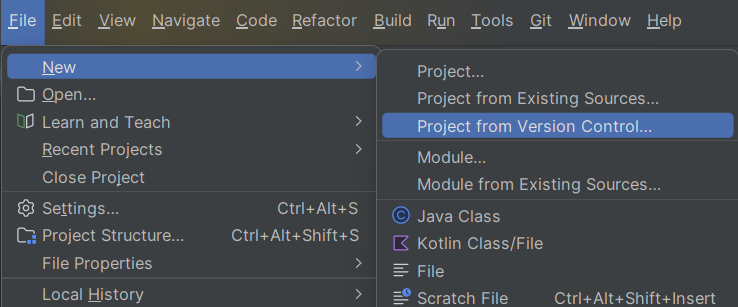

# Утилита для фильтрации файловых данных

## Описание
При запуске утилиты в командной строке подается несколько файлов, содержащих вперемешку целые числа, строки и вещественные числа. В качестве разделителя используется перевод строки. Строки из файлов читаются по очереди в соответствии с их перечислением в командной строке.
Задача утилиты записать разные типы данных в разные файлы. Целые числа в один выходной файл, вещественные в другой, строки в третий. По умолчанию файлы с результатами располагаются в текущей папке с именами integers.txt, floats.txt, strings.txt

## Используемые технологии
**Java 23**, **Maven**, **JCommander**

## Зависимости проекта
**JCommander 2.0** - для удобного парсинга параметров командной строки, используя аннотации и выделенный класс.

## Плагины Maven
1. **Maven JAR Plugin 3.2.0** - для упаковки проекта в JAR.
2. **Maven Assembly Plugin 3.7.1** - для автоматической упаковки зависимостей.

## Обрабатываемые параметры командной строки
    -p - задает префикс для имени выходных файлов
    -o - задает путь для выходных файлов
    -a - режим добавления в существующие файлы
    -s - вывод краткой статистики по записанным данным
    -f - вывод полной статистики по записанным данным

    Программа не требует специфичного параметра для передачи пути до файла.

# Работа с программой
## Запуск и передача данных с помощью IDE
### Копирование проекта
1. Копируем путь до репозитория.
```
https://github.com/Alexander-Isakov/cft-parser-test.git
```
2. File -> New -> New Project From Version Control
   
3. Вставляем URL и нажимаем Clone


### Запуск проекта
1. Задаем нужные нам параметры командной строки с помощью "Edit Configurations"
 

2. Запускаем проект и видим, что программа создала файлы с нужными нам параметрами (с префиксом "new") и также вывела краткую статистику по кол-ву записанных данных.


## Запуск и передача данных с помощью командной строки:
1. Переходим в Maven и нажимаем "Execute Maven Goal"
2. Выполняем следующую команду:
```
mvn clean compile assembly:single
```
3. Видим, что Maven создал нам JAR со всеми зависимостями по определенному пути:
```
   [INFO] Building jar: C:\Users\Public\cft-parser-test\target\parser-1-jar-with-dependencies.jar
   [INFO] ------------------------------------------------------------------------
   [INFO] BUILD SUCCESS
   [INFO] ------------------------------------------------------------------------
   [INFO] Total time:  2.661 s
   [INFO] Finished at: 2025-01-20T23:28:40+04:00
   [INFO] ------------------------------------------------------------------------
```
4. В Target папку передаем нужные нам файлы с входными данными и запускаем с помощью CMD. Пример:
```
java -jar parser-1-jar-with-dependencies.jar -f -p new- in1.txt in2.txt
```